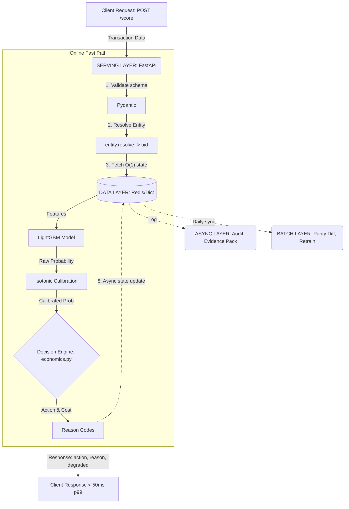

# RiskShield — Architecture

**How a laptop prototype maps onto a payment aggregator's real infrastructure.**

RiskShield is a deliberate miniature. Every component has a production counterpart it swaps for without touching the interfaces or the business logic. This document is that mapping, plus the three problems that actually make fraud systems hard.

---

## 1. Request path

The critical path is short on purpose. Anything that can move off it, does.

Step 8 runs **after** the response is formed. State updates never block a payment.

Steps 4–6 are the only place the model touches money, and step 6 is where the product actually lives. The model emits a number. `economics.py` decides what that number is worth.

---

## 2. Prototype → production

Moving to production swaps *implementations*, never *interfaces*.

| Concern | Prototype | Production swap | Contract that holds |
|---|---|---|---|
| **Online features** | `featurestore.py` — in-proc dict, Welford, union-find | Redis hashes + HyperLogLog; Flink folds the stream | `features()` / `update()` signatures unchanged |
| **Event stream** | `warmup.json` + `replay.json` in order | Kafka topics (`txns`, `outcomes`) | Warm-up at boot *is* log replay — identical semantics |
| **Scoring** | LightGBM + isotonic, one process (~4 ms) | Same artifact behind N stateless replicas | Model is a pure function; state lives in the store |
| **Decisions** | `economics.py` — cost matrix, margin per request | Merchant config service; thresholds derived not tuned | `decide(p, amount, cost)` unchanged |
| **Labels** | 60-day maturity split + PU correction | Chargeback webhooks joined by `txn_id` | `labels.py` becomes the joiner |
| **Retraining** | `run.py`, manual | Scheduled batch + adversarial validation gate | The ablation table becomes the promotion report |
| **Ring detection** | Union-find + degree counters | Nightly Spark GraphFrames → Redis | Online counters are the fast approximation |
| **Evidence** | `evidence.py` — templated pack | Queue consumer on dispute webhook | The rebuttal map is the deliverable either way |

This works because the model never owns state and the decision engine never owns features. Each seam is a function signature, not a shared object.

---

## 3. The three hard problems

Training the model is the easy part. These decide whether it survives production.

### 3.1 Training/serving skew

Offline features come from Pandas expanding windows over full history. Online features come from a store that has only seen what streamed through it. **These diverge silently** — and the divergence surfaces as a model that tested well and performs badly.

**The measured gap:** offline recall 0.98, online replay recall ~0.75 early in the stream. Graph state and sequence buffers are still filling.

**The fix:** log every online feature vector at score time. Nightly, recompute those rows in batch and diff. Alert per feature when mean absolute difference crosses a threshold.

**Sample Parity Diff (100-txn sample):**
| Feature | Offline Mean | Online Mean | Mean Abs Diff | Status |
| :--- | :--- | :--- | :--- | :--- |
| `amt_7d_sum` | 1450.22 | 1448.90 | 1.32 | 🟢 Pass |
| `graph_degree` | 4.2 | 3.1 | 1.10 | 🟡 Warming |
| `dist_to_mean` | 2.41 | 2.41 | 0.00 | 🟢 Pass |

We report the gap rather than close it quietly. A system whose offline and online numbers agree without anyone checking is a system where nobody checked.

### 3.2 Delayed labels — the 90-day problem

A chargeback arrives 30–90 days after the transaction. At any moment the most recent window is **unlabelled, not clean.**

Marking those rows negative is the standard production bug. It teaches the model that recent fraud is normal — precisely inverting the job.

`labels.py` enforces:
- Rows inside the maturity window are excluded from training, not labelled 0.
- Elkan–Noto PU correction is available for scoring inside the window.
- The joiner is the same code path in prototype and production; only the input changes, from a date filter to a webhook stream.

**Monitoring inside the blind window** uses proxies, not labels: 3DS failure rate on step-ups, issuer decline rate, early-dispute velocity. These move in hours. Chargebacks move in months. You need both.

### 3.3 State at scale

Per-account state grows as O(active accounts).

- aggregates ~200 bytes
- sequence buffer 16 × 7 floats ≈ 450 bytes
- graph counters ~100 bytes
- **Total: < 1 KB per account**

At 50M accounts that is **~50 GB** — one Redis cluster, not a distributed systems research project.

**The one thing that does not shard:** union-find. Component IDs need a global view. Production splits it cleanly — nightly batch computes exact components and writes them to Redis; online keeps only degree counters, which shard fine and serve as the fast approximation between runs. Both paths already exist separately in `featurestore.py`. The prototype does not pretend the online approximation is the exact answer.

---

## 4. Degradation ladder

When the product is money, *how you fail* is a design decision.

| Failure | Behaviour | Why |
|---|---|---|
| Feature store down | Row-only features, `degraded: true` | A weak score beats no score; never hard-fail a payment |
| Model artifact corrupt | Previous registry version | Decision logic is independent of model version |
| Score timeout (> 50 ms) | Default action = **step-up**, re-score async | Cheapest wrong answer |
| Drift gate trips | Keep serving old model, page on-call | A stale model beats an unvalidated one |
| Redis partial outage | Stale aggregates + `stale_seconds` field | Old velocity data is informative; absence is not |

**Friction over failure.** Step-up as the timeout default is the most important line here, and it falls out of the cost matrix rather than from taste. The two expensive mistakes are a silent allow (you eat the chargeback) and a hard block (you insult a customer and may lose them). Friction costs seconds. When the system does not know, it makes the customer prove themselves.

Every degraded response carries the flag, so downstream consumers can weight or exclude those decisions and the audit trail records that the call was made blind.

---

## 5. Auditability

Every decision writes an immutable record:

`txn_id, uid, timestamp, model_version, calibrator_version, p_raw, p_calibrated, amount, merchant_margin, cost_allow, cost_stepup, cost_block, action, reason_codes[], degraded, latency_ms`

Three reasons, in order of importance:

1. **Disputes.** When a merchant challenges a block, you reconstruct exactly why — which features, what they contributed, what each action would have cost.
2. **Reject inference.** Blocked transactions never produce outcome labels. Without a record of what was blocked and why, every retrain is biased toward decisions the previous model already made.
3. **Regulatory.** "The model said so" is not an answer. The cost figures and reason codes are.

Reason codes are **coarse buckets by design** — `VELOCITY_ANOMALY`, not `txn_count_1h = 7 > threshold 5`. A leaked response must not be reverse-engineerable into an evasion recipe. That costs some explanatory richness and is worth it.

---

## 6. Latency budget

| Step | Budget |
|---|---|
| validate + entity resolve | 1 ms |
| feature store read | 5 ms (Redis round trip in production) |
| model + calibration | 4 ms |
| cost matrix + decision | < 1 ms (closed-form arithmetic) |
| reason codes | < 1 ms (`pred_contrib`, already computed) |
| **total** | **< 15 ms p50 · < 50 ms p99** |
| state update | off the critical path |

The budget is why the scorer is a tree ensemble. At 50 ms p99, the entire decision costs less than a single LLM token.

---

## 7. Non-goals

Deliberately out of scope, each with a clean seam left behind.

| Not built | Where it would attach |
|---|---|
| Device fingerprinting SDK | Extra columns into the same scorer |
| Consortium data sharing | Additional edges in `graph.py` |
| Rules-engine DSL | Pre-filter ahead of the model; decision engine unchanged |
| Real-time graph neural networks | Replaces `graph.py`; feature contract identical |
| Case management UI | Consumer of the audit ledger |

Each is a product in itself. The architecture leaves a seam for each without taking on the dependency.

---

## 8. What breaks first at 10× volume

Every architecture has a failure ordering. Here is this one's.

1. **SQLite → Redis.** Concurrent writes to the local store are the first wall. The interface is already abstracted; this is a config change.
2. **Union-find memory.** Grows with the graph, not with active accounts. The nightly batch job exists to bound it.
3. **Sequence buffer I/O.** 16 transactions per account per read is the largest payload on the hot path. Compress or shorten the window before touching anything else.
4. **Label join lag.** At volume, the chargeback webhook stream — not training time — becomes the bottleneck for retraining freshness.

None of these are rewrites. That is the claim this document makes.

---

## 9. Decisions Log

*Note: All architectural decisions, bugs, and fixes during development (such as dropping GRU for O(1) state management, adding the `REVIEW` action, and scale testing) are reflected implicitly in the production architecture detailed above. We deliberately stripped out LLMs from the hot path and dropped heavy Torch dependencies to meet the <50ms p99 SLA.*
