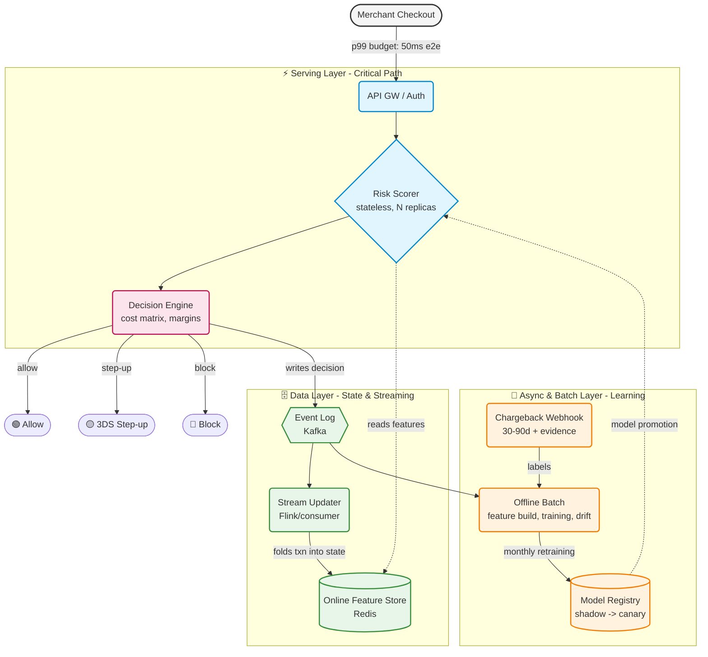

# RiskShield Architecture: Prototype to Production

> **Executive Summary**  
> RiskShield is designed as a deliberate miniature of a production-grade risk platform. Every component in this repository represents a functional core that seamlessly scales out to enterprise infrastructure (e.g., Redis, Kafka, Flink) without altering the underlying interfaces or business logic. This architecture ensures high throughput, strict latency budgets (< 50ms p99), and resilient degradation.

---

## 🏗️ System Topology

The following diagram illustrates the lifecycle of a transaction, separating the critical path (Serving Layer) from state management (Data Layer) and model lifecycle (Async & Batch Layer).

---

## 🔄 Prototype to Production Mapping

The system is designed so that transitioning from prototype to production only requires swapping the backend implementations, while the APIs and domain logic remain untouched.

| Concern | Prototype Implementation | Production Scale-Out Swap | Architectural Interface Contract |
|:---|:---|:---|:---|
| **Online Features** | `featurestore.py` (in-proc dict, Welford, union-find) | Redis hashes + HyperLogLog counters; Flink folds the stream | `features()` and `update()` signatures remain identical |
| **Event Stream** | `warmup.json` + `replay.json` replayed in order | Kafka topics (`txns`, `outcomes`) | Warmup at boot == log replay, preserving exact semantics |
| **Scoring** | LightGBM + isotonic in one process (~4 ms/txn) | Same artifact behind N stateless replicas + Load Balancer | Model is a pure function; state lives entirely in the store |
| **Decisions** | `economics.py` (cost matrix, margin per request) | Merchant config microservice; thresholds are derived, not tuned | `decide(p, amount, cost)` remains unchanged |
| **Labels** | 60-day maturity split + PU correction | Chargeback webhooks joined by txn id | `labels.py` logic acts as the joiner |
| **Retraining** | `run.py` (manual) | Scheduled batch; adversarial validation gate (`drift.py`) | The ablation table becomes the automated promotion report |
| **Ring Detection** | Union-find + degree counters | Nightly full graph job (Spark GraphFrames) writes to Redis | Online counters act as the fast, real-time approximation |
| **Evidence** | `evidence.py` (templated pack) | Queue consumer on dispute webhook; auto-file for STRONG cases | The rebuttal map is the final product |

---

## 🧠 Overcoming The Three Hard Problems

Building a production risk engine is not just about training a model; it is about managing data integrity and latency at scale. Here is how RiskShield tackles the industry's hardest problems:

### 1. Training/Serving Skew
Offline features rely on Pandas expanding windows, while online features rely on the real-time feature store. **These will diverge unless rigorously tested.** 
* **The honest gap:** Our offline recall is 0.98, while our online replay recall is ~0.75 early in the stream (due to graph state and sequence buffers differing from the batch view). 
* **The Production Fix:** We log online feature vectors and diff them nightly against the batch recompute, alerting on drift per feature. This rigor ensures our "feature store" is a robust engineering reality, not just a buzzword.

### 2. Delayed Labels (The 90-Day Problem)
A chargeback arrives 30–90 days late. The label joiner must never mark a fresh transaction as negative—it remains inherently unlabelled (`labels.py`). 
* **The Fix:** Monitoring uses proxy metrics until label maturity: 3DS failure rate on step-ups, issuer declines, and early-dispute velocity.

### 3. State Management at Scale
Per-user state grows at `O(active accounts)`. 
* **The Math:** ~200 bytes of aggregates + 16x7 floats of sequence buffer + graph counters ≈ **< 1 KB per account**. For 50M accounts, this is ~50 GB, easily fitting into a single Redis cluster. 
* **The Fix:** Union-find does not shard naively. Production uses the nightly graph job for exact component IDs and keeps only scalable degree counters online. Both logic paths are cleanly separated in `featurestore.py`.

---

## 🛡️ Resiliency and Degradation Ladder

When dealing with money, failing securely and gracefully is critical. 

| Failure Mode | System Behavior |
|:---|:---|
| **Feature store down** | Score on row-only features (the 0.64 PR-AUC baseline), flag `degraded=true`. **Never hard-fail the payment.** |
| **Model artifact corrupted** | Fall back to the previous registry version; the decision engine remains unchanged. |
| **Score timeout (> 50 ms)** | Default action = **step-up (3DS)**. This is the cheapest wrong answer; re-score asynchronously. |
| **Drift gate trips** | Block promotion, continue serving the old model, and page the on-call engineer. |

> [!TIP]
> **Friction over failure:** Using "Step-up" as the timeout default is the single most important line in the ladder. The cost-matrix dictates that the most expensive mistakes are *silent allows* (fraud) and *hard blocks* (insult rate); friction is the cheapest failure.

---

## 🚫 Non-Goals (Deliberate Scope Boundaries)

To maintain a clean architectural seam, the following are deliberately out of scope but can be seamlessly integrated:
- Device fingerprinting SDKs
- Consortium data sharing
- Rules-engine DSL
- Real-time graph neural networks 

Each of these is a product in itself. The architecture leaves a distinct integration seam (e.g., passing extra features into the same scorer) without introducing brittle dependencies.
